# JavaScript Semantic Anchors — A Reference Guide

**A catalog of canonical JS concepts you can invoke by name** — either to learn the language, or to communicate with an LLM about it efficiently. Each anchor is a single phrase that unlocks a body of knowledge.

> Inspired by [Semantic Anchors](https://llm-coding.github.io/Semantic-Anchors/) — a catalog of well-defined terms that act as high-leverage prompt vocabulary for LLMs.
>
> This guide applies the same idea to **JavaScript**: each "anchor" is a canonical concept you can invoke by name. Naming a thing precisely is half of understanding it — and the other half of getting an LLM to help you with it.

---

## How to read this guide

Each anchor follows the same structure:

- **What it is** — a one-line definition.
- **Why it matters** — when this concept shows up in real code or interviews.
- **Example** — minimum-viable code.
- **Pitfalls** — the wrong intuition most people start with.
- **Learn more** — a canonical reference.

The links favor **MDN** (the authoritative JS reference), **TC39** (the spec), **Node.js docs**, and **V8/web.dev** (engines & performance).

> **Diagrams:** rendered with [Mermaid](https://mermaid.js.org/). GitHub, GitLab, VS Code (Markdown Preview Mermaid Support), Obsidian, Notion, and most modern markdown viewers render them as images automatically. If you see raw code blocks instead, install a Mermaid-aware preview extension.

---

## Table of Contents

- [Quick Reference — Anchor Tables](#quick-reference--anchor-tables)

1. [Execution Model](#1-execution-model)
2. [Type System & Coercion](#2-type-system--coercion)
3. [Objects, Prototypes, Classes](#3-objects-prototypes-classes)
4. [Functions & Functional Patterns](#4-functions--functional-patterns)
5. [Async Patterns](#5-async-patterns)
6. [Modern Syntax (ES2015+)](#6-modern-syntax-es2015)
7. [Modules](#7-modules)
8. [Design Patterns in JS](#8-design-patterns-in-js)
9. [Error Handling](#9-error-handling)
10. [Performance & Memory](#10-performance--memory)
11. [Testing](#11-testing)
12. [Tooling](#12-tooling)
13. [Browser Runtime](#13-browser-runtime)
14. [Node.js Runtime](#14-nodejs-runtime)
15. [TypeScript Bridge](#15-typescript-bridge)
16. [Using anchors with LLMs](#16-using-anchors-with-llms)
17. [Curated learning paths & books](#17-curated-learning-paths--books)

---

## Quick Reference — Anchor Tables

Skim these tables to find the right anchor by name. Jump to the matching numbered section below for the full *what / why / example / pitfalls / learn-more* breakdown.

### 1. Language Core — Execution Model

| Anchor | What it unlocks |
|---|---|
| **Event Loop** | Single-threaded execution, call stack + task queue + microtask queue |
| **Microtask vs Macrotask** | Promises/`queueMicrotask` drain before `setTimeout`/`setImmediate`/I/O |
| **Call Stack** | LIFO frames, stack overflow, async boundary loses sync context |
| **Hoisting** | `var`/function declarations lifted; `let`/`const` hoisted but in TDZ |
| **TDZ (Temporal Dead Zone)** | `let`/`const` exist but unreachable until declaration line |
| **Lexical Scope** | Scope determined by *where* code is written, not *where* it's called |
| **Closure** | Inner function retains access to outer scope after outer returns |
| **`this` Binding Rules** | Default → implicit → explicit (`call`/`apply`/`bind`) → `new` → arrow (lexical) |
| **Strict Mode** | `'use strict'`; silent errors throw, `this` no longer coerced |

> **Invoke when:** explaining why code runs in a certain order, or debugging scope/timing bugs.

### 2. Type System & Coercion

| Anchor | What it unlocks |
|---|---|
| **Primitive vs Reference** | string/number/bigint/bool/null/undefined/symbol vs object/array/function |
| **Type Coercion** | `==` triggers `ToPrimitive`/`ToNumber`; `===` does not |
| **Falsy Values** | `false, 0, -0, 0n, "", null, undefined, NaN` — everything else truthy |
| **NaN Semantics** | `NaN !== NaN`; use `Number.isNaN`, not global `isNaN` |
| **Boxing / Autoboxing** | `"x".length` works because primitive is temporarily wrapped |
| **Symbol & Well-Known Symbols** | `Symbol.iterator`, `Symbol.asyncIterator`, `Symbol.toPrimitive` |

### 3. Objects, Prototypes, Classes

| Anchor | What it unlocks |
|---|---|
| **Prototype Chain** | `__proto__` lookup chain; `Object.create`, `Object.getPrototypeOf` |
| **Prototypal Inheritance** | Delegation over copying; classes are sugar over this |
| **Class Syntax / Class Fields** | `class`, `#private`, `static`, public class fields |
| **Property Descriptors** | `writable`, `enumerable`, `configurable`, getters/setters |
| **`Object.freeze` / `seal` / `preventExtensions`** | Immutability tiers |
| **Proxy & Reflect** | Meta-programming hooks — intercept `get`/`set`/`has`/`deleteProperty` |

### 4. Functions & Functional Patterns

| Anchor | What it unlocks |
|---|---|
| **First-Class Functions** | Functions are values: passed, returned, stored |
| **Higher-Order Function (HOF)** | Takes/returns another function |
| **Pure Function** | No side effects, deterministic — same input → same output |
| **Immutability** | Don't mutate, return new value (`map`/`filter`/spread) |
| **Currying** | `f(a, b, c)` → `f(a)(b)(c)` |
| **Partial Application** | Pre-fill some args (`fn.bind(null, a)`) |
| **Composition** | `compose(f, g)(x) === f(g(x))` |
| **Point-Free Style** | Define functions without naming the argument |
| **IIFE** | `(function(){})()` — module scope before ES modules existed |
| **Arrow Function Semantics** | No own `this`/`arguments`/`prototype`; not `new`-able |

### 5. Async Patterns

| Anchor | What it unlocks |
|---|---|
| **Callback Hell / Pyramid of Doom** | Why Promises were invented |
| **Promise States** | pending → fulfilled / rejected; immutable once settled |
| **Promise Chaining** | `.then` returns a new Promise; flatten by returning |
| **async/await** | Syntactic sugar over Promises; `await` pauses the async function only |
| **`Promise.all` / `allSettled` / `race` / `any`** | Parallel composition primitives |
| **Unhandled Rejection** | Process-level event; lint with `no-floating-promises` |
| **AbortController** | Cancellation token for `fetch`, timers, custom async work |
| **Async Iterator / `for await…of`** | Streaming async sequences |
| **Backpressure** | Producer-faster-than-consumer; relevant in Node streams |

### 6. Modern Syntax (ES2015+)

| Anchor | What it unlocks |
|---|---|
| **Destructuring** | `const {a, b: rename = default} = obj` |
| **Spread / Rest** | `...` in arrays, objects, params |
| **Default Parameters** | `function f(x = 1)` |
| **Template Literals** | `` `${expr}` ``, tagged templates |
| **Optional Chaining** | `a?.b?.c` short-circuits on null/undefined |
| **Nullish Coalescing** | `a ?? b` — falls back only on null/undefined (not `0` / `""`) |
| **Logical Assignment** | `a ??= b`, `a \|\|= b`, `a &&= b` |
| **Generators / `yield`** | Pausable functions; basis for redux-saga, coroutines |
| **Top-Level Await** | In ES modules only |

### 7. Modules

| Anchor | What it unlocks |
|---|---|
| **CommonJS (CJS)** | `require` / `module.exports`; synchronous, dynamic |
| **ES Modules (ESM)** | `import` / `export`; static, async, tree-shakeable |
| **UMD / AMD** | Legacy universal/async module formats |
| **Tree Shaking** | Dead-code elimination via ESM static analysis |
| **Dynamic Import** | `import()` returns Promise; enables code splitting |
| **Dual Package Hazard** | Same package loaded as both CJS and ESM → two copies |

### 8. Design Patterns (JS Flavored)

| Anchor | What it unlocks |
|---|---|
| **Module Pattern / Revealing Module** | Pre-ESM encapsulation via IIFE + closure |
| **Observer / EventEmitter** | Node's `events` module, DOM event model |
| **Pub/Sub** | Decoupled observer via central broker |
| **Singleton** | One instance per module — natural in ESM |
| **Factory Function** | Object creation without `new` |
| **Mixin / Object Composition** | Combine behaviors via `Object.assign` |
| **Middleware Pattern** | `(req, res, next)` — Express, Koa, Redux |
| **Strategy Pattern** | Swap algorithms at runtime via function passing |

### 9. Error Handling

| Anchor | What it unlocks |
|---|---|
| **try/catch/finally** | Synchronous (and inside `async`) error capture |
| **Error Cause** | `new Error('x', { cause: original })` — chain causality |
| **Custom Error Classes** | `extends Error`, set `name`, preserve stack |
| **Fail Fast** | Throw early at boundary; don't swallow |
| **Result / Either Type** | Functional alternative to throwing (e.g., `neverthrow`) |

### 10. Performance & Memory

| Anchor | What it unlocks |
|---|---|
| **V8 / JIT** | Hidden classes, inline caches, deopt triggers |
| **Garbage Collection** | Mark-and-sweep; references prevent collection |
| **Memory Leak Sources** | Timers, listeners, closures over large scope, detached DOM |
| **Debounce vs Throttle** | Trailing-edge wait vs rate limit |
| **Memoization** | Cache by argument identity |
| **Web Workers** | Off-main-thread execution; `postMessage` boundary |
| **Lazy Loading / Code Splitting** | Defer work until needed |
| **Virtual DOM / Reconciliation** | Diff-and-patch (React, Vue) |

### 11. Testing

| Anchor | What it unlocks |
|---|---|
| **AAA (Arrange / Act / Assert)** | Test structure |
| **Given-When-Then** | BDD phrasing equivalent |
| **TDD Red → Green → Refactor** | Fail → pass → clean cycle |
| **Test Double Taxonomy** | Dummy / Stub / Spy / Mock / Fake |
| **Snapshot Test** | Serialize and diff over time |
| **Property-Based Test** | Generate inputs, assert invariants (`fast-check`) |
| **Vitest / Jest** | Default modern runners; jsdom or happy-dom for DOM |

### 12. Tooling

| Anchor | What it unlocks |
|---|---|
| **Bundler** | esbuild / Vite / webpack / Rollup — graph → output |
| **Transpiler** | Babel / SWC / TypeScript — newer syntax → older target |
| **Polyfill vs Transpile** | Runtime API shim vs syntax rewrite |
| **Source Map** | Map minified line → original |
| **Monorepo / Workspaces** | pnpm / npm / yarn workspaces, turborepo, nx |
| **Lockfile** | Deterministic dependency tree (`package-lock.json`, `pnpm-lock.yaml`) |
| **Semver** | `MAJOR.MINOR.PATCH`; `^` / `~` range semantics |

### 13. Runtime-Specific

**Browser**
- **DOM / BOM**, **Shadow DOM**, **Custom Elements**, **CSSOM**
- **Critical Rendering Path**, **Reflow vs Repaint**
- **CORS / Same-Origin Policy**, **CSP**, **SameSite Cookies**
- **Web Storage / IndexedDB / Cache API**
- **Service Worker**, **PWA**, **Web Components**

**Node.js**
- **Event Loop Phases** (timers → pending → poll → check → close)
- **Streams** (Readable/Writable/Duplex/Transform), **Backpressure**
- **Buffer**, **Cluster**, **Worker Threads**
- **CommonJS resolution**, **`node_modules` lookup**
- **`process.nextTick` vs `setImmediate`**

### 14. TypeScript Bridge (companion anchors)

| Anchor | What it unlocks |
|---|---|
| **Structural Typing** | Shape-based, not name-based |
| **Discriminated Union** | `type T = {kind:'a'} \| {kind:'b'}` + narrowing |
| **Type Narrowing** | `typeof` / `instanceof` / `in` / user-defined guards |
| **Generics & Constraints** | `<T extends X>` |
| **Utility Types** | `Partial`, `Required`, `Pick`, `Omit`, `Record`, `ReturnType` |
| **`unknown` vs `any`** | Safe top vs unsafe escape hatch |

### How to use this guide (three modes)

**As a learner:** treat each anchor as a study unit. Pick one, read MDN's page on it, write 5 lines that demonstrate it. You "know" JavaScript when you can explain each anchor without notes.

**As an LLM prompt vocabulary:** instead of describing what you want, name the anchor.

```
❌ "Make this function not crash when the property might not exist"
✅ "Rewrite with optional chaining and nullish coalescing"

❌ "I want a function that remembers its results so it's faster"
✅ "Add memoization keyed on the first argument"

❌ "The order things print isn't what I expected"
✅ "Walk me through the event loop, microtask queue, and where this await suspends"
```

**As a code-review checklist:** scan a PR against the anchors that matter for the change. For async code → Promise chaining, unhandled rejection, AbortController. For class hierarchies → prototype chain, `this` binding. For perf changes → memoization, debounce/throttle, lazy loading.

> The whole point of semantic anchors: **the LLM (and any seasoned JS dev) already knows what each row means.** The tables above are the index; the sections below are the encyclopedia.

---

## 1. Execution Model

### Event Loop
- **What it is:** JavaScript's single-threaded scheduler that pulls tasks from queues into the call stack.
- **Why it matters:** Explains every async surprise you've ever had. Order of `setTimeout`, Promises, and synchronous code is fully determined by this.

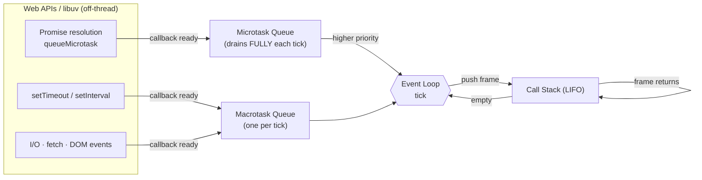

- **Example:**
  ```js
  console.log('A');
  setTimeout(() => console.log('B'), 0);
  Promise.resolve().then(() => console.log('C'));
  console.log('D');
  // A, D, C, B   (microtasks before macrotasks)
  ```
- **Pitfalls:** Thinking `setTimeout(fn, 0)` means "immediately." It means "after current sync code + all microtasks."
- **Learn more:** [MDN: The event loop](https://developer.mozilla.org/en-US/docs/Web/JavaScript/Event_loop) · [Jake Archibald's *In The Loop* talk](https://www.youtube.com/watch?v=cCOL7MC4Pl0) · [Philip Roberts' *What the heck is the event loop?*](https://www.youtube.com/watch?v=8aGhZQkoFbQ)

### Microtask vs Macrotask
- **What it is:** Two queues. Microtasks (Promises, `queueMicrotask`, `MutationObserver`) drain *completely* between every macrotask (`setTimeout`, I/O, UI events).
- **Pitfall:** An infinite chain of `.then` calls can starve macrotasks (and UI rendering).
- **Learn more:** [Tasks, microtasks, queues, schedules](https://jakearchibald.com/2015/tasks-microtasks-queues-and-schedules/)

### Call Stack
- **What it is:** LIFO stack of function activation records.
- **Async lesson:** When a Promise resolves, the original call stack is gone. That's why error stack traces look strange across `await` boundaries — though modern engines now stitch "async stack traces" together.
- **Learn more:** [MDN: Call stack](https://developer.mozilla.org/en-US/docs/Glossary/Call_stack)

### Hoisting
- **What it is:** Declarations are conceptually moved to the top of their scope. `function` declarations are fully hoisted; `var` is hoisted with `undefined`; `let`/`const`/`class` are hoisted but uninitialized (TDZ).

```
Scope timeline for `let y = 2;`
─────────────────────────────────────────────────
{                                                 ← scope begins
│   <TDZ — `y` exists but is unreachable>         ← ReferenceError if touched
│   ...
│   let y = 2;   ← initialization point
│   <`y` is live and usable>
}                                                 ← scope ends
```

- **Example:**
  ```js
  hi();                    // works — function decl hoisted
  console.log(x);          // undefined — var hoisted, value isn't
  console.log(y);          // ReferenceError — TDZ
  function hi(){}
  var x = 1;
  let y = 2;
  ```
- **Learn more:** [MDN: Hoisting](https://developer.mozilla.org/en-US/docs/Glossary/Hoisting)

### TDZ (Temporal Dead Zone)
- **What it is:** The region from the start of a block to the `let`/`const` declaration line where the binding exists but is unreachable.
- **Why it matters:** Prevents the silent `undefined` bugs that plagued `var`.
- **Learn more:** [MDN: let](https://developer.mozilla.org/en-US/docs/Web/JavaScript/Reference/Statements/let#temporal_dead_zone_tdz)

### Lexical Scope
- **What it is:** Scope is decided by *where code is written* (the source), not where it's called.
- **Counter-anchor:** Dynamic scope (what `this` looks like at first, but it's actually more nuanced).
- **Learn more:** [You Don't Know JS: Scope & Closures](https://github.com/getify/You-Dont-Know-JS/blob/2nd-ed/scope-closures/README.md)

### Closure
- **What it is:** A function that "remembers" the scope chain at the time it was created.
- **Why it matters:** The foundation of data privacy, partial application, and React Hooks.

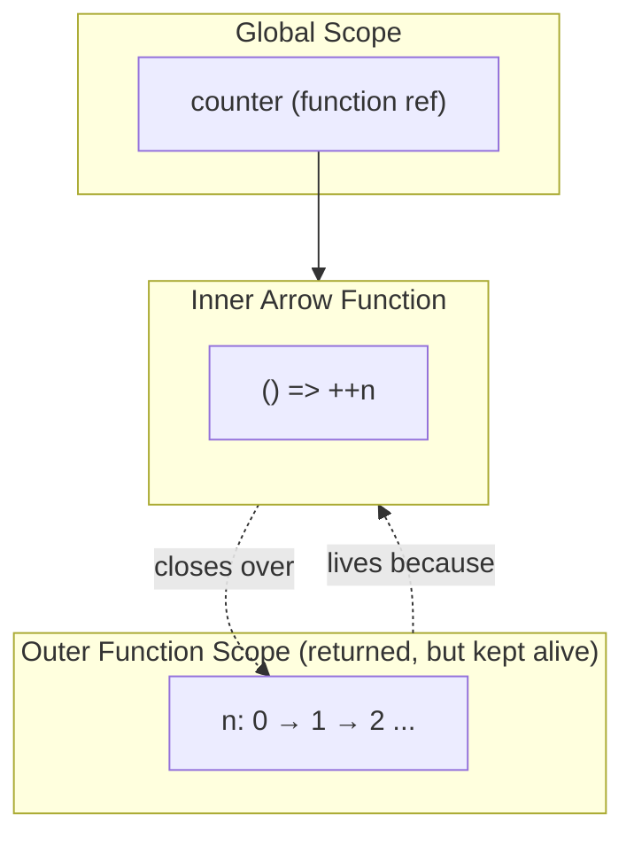

- **Example:**
  ```js
  const counter = (() => {
    let n = 0;
    return () => ++n;
  })();
  counter(); // 1
  counter(); // 2
  ```
- **Learn more:** [MDN: Closures](https://developer.mozilla.org/en-US/docs/Web/JavaScript/Closures)

### `this` Binding Rules
- **What it is:** Four rules, applied in order:
  1. `new` → new object
  2. explicit (`.call`, `.apply`, `.bind`) → given object
  3. implicit (`obj.fn()`) → `obj`
  4. default → `undefined` (strict) or `globalThis`
  Arrow functions don't get their own `this` — they inherit from the enclosing lexical scope.

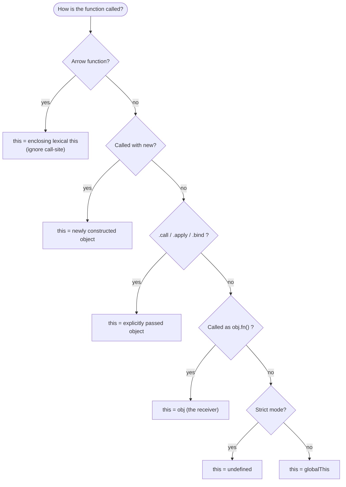

- **Pitfall:** Passing a method as a callback (`btn.onclick = obj.handler`) loses the `this` binding.
- **Learn more:** [MDN: this](https://developer.mozilla.org/en-US/docs/Web/JavaScript/Reference/Operators/this)

### Strict Mode
- **What it is:** `'use strict'` (or any ES module). Disallows silent errors, forbids `with`, makes `this` `undefined` in standalone calls.
- **Learn more:** [MDN: Strict mode](https://developer.mozilla.org/en-US/docs/Web/JavaScript/Reference/Strict_mode)

---

## 2. Type System & Coercion

### Primitive vs Reference
- **What it is:** Primitives (`string`, `number`, `bigint`, `boolean`, `null`, `undefined`, `symbol`) are immutable & compared by value. Objects/arrays/functions are compared by reference.

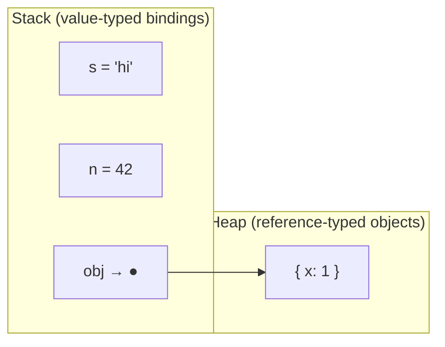

- **Example:**
  ```js
  [1] === [1];        // false — different references
  'a' === 'a';        // true  — same value
  ```
- **Learn more:** [MDN: Data types](https://developer.mozilla.org/en-US/docs/Web/JavaScript/Data_structures)

### Type Coercion
- **What it is:** Automatic conversion via abstract operations (`ToPrimitive`, `ToNumber`, `ToString`). `==` triggers it; `===` does not.

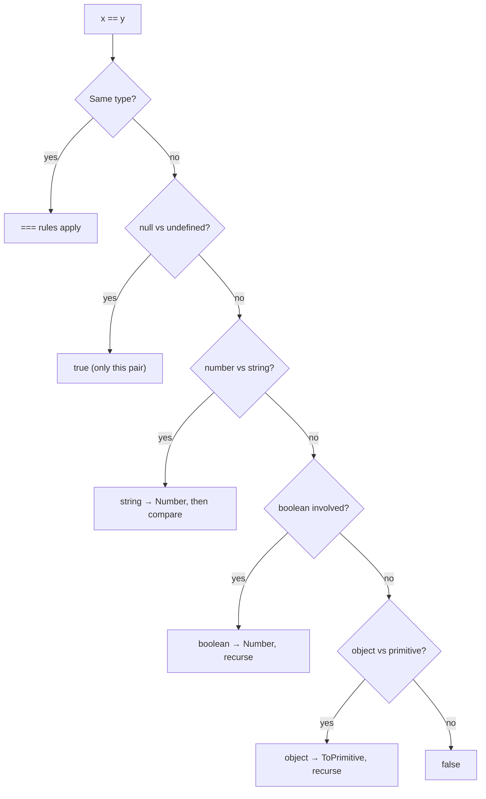

- **Famous example:**
  ```js
  [] == ![];   // true   — ![] → false → 0; [] → "" → 0
  '0' == 0;    // true
  '0' === 0;   // false
  ```
- **Rule of thumb:** Always use `===` unless you specifically want `null == undefined` coercion.
- **Learn more:** [MDN: Equality comparisons](https://developer.mozilla.org/en-US/docs/Web/JavaScript/Equality_comparisons_and_sameness) · [JS Comparison Table](https://dorey.github.io/JavaScript-Equality-Table/)

### Falsy Values
- **What it is:** Values that coerce to `false` in boolean context: `false, 0, -0, 0n, "", null, undefined, NaN`. Everything else is truthy — including `"0"`, `"false"`, `[]`, `{}`.
- **Learn more:** [MDN: Falsy](https://developer.mozilla.org/en-US/docs/Glossary/Falsy)

### NaN Semantics
- **Quirk:** `NaN !== NaN` (only value not equal to itself).
- **Detect with:** `Number.isNaN(x)` — not the global `isNaN`, which coerces first.
- **Learn more:** [MDN: NaN](https://developer.mozilla.org/en-US/docs/Web/JavaScript/Reference/Global_Objects/NaN)

### Boxing
- **What it is:** Primitives are temporarily wrapped in object form to access methods. `"abc".length` works because `"abc"` is briefly a `String` object.
- **Learn more:** [MDN: String](https://developer.mozilla.org/en-US/docs/Web/JavaScript/Reference/Global_Objects/String)

### Symbols & Well-Known Symbols
- **What it is:** Unique, non-string keys. Well-known symbols (`Symbol.iterator`, `Symbol.asyncIterator`, `Symbol.toPrimitive`) hook into language behavior.
- **Example:**
  ```js
  const range = {
    from: 1, to: 3,
    [Symbol.iterator]() {
      let cur = this.from, last = this.to;
      return { next: () => cur <= last ? {value: cur++, done: false} : {done: true} };
    }
  };
  [...range]; // [1,2,3]
  ```
- **Learn more:** [MDN: Symbol](https://developer.mozilla.org/en-US/docs/Web/JavaScript/Reference/Global_Objects/Symbol)

---

## 3. Objects, Prototypes, Classes

### Prototype Chain
- **What it is:** Every object has an internal `[[Prototype]]` (exposed as `__proto__` / `Object.getPrototypeOf`). Property lookup walks this chain.

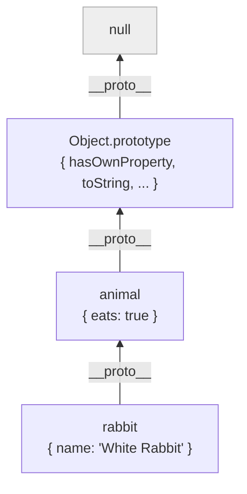

> Property lookup on `rabbit.eats`: not own → climb to `animal` → found `eats: true`. Lookup on `rabbit.toString`: climbs all the way to `Object.prototype`.

- **Example:**
  ```js
  const animal = { eats: true };
  const rabbit = Object.create(animal);
  rabbit.eats; // true — found via prototype
  ```
- **Learn more:** [MDN: Inheritance and the prototype chain](https://developer.mozilla.org/en-US/docs/Web/JavaScript/Inheritance_and_the_prototype_chain)

### Prototypal Inheritance
- **What it is:** Delegation, not copying. Method calls walk up `[[Prototype]]` chain at call time.
- **Counter-anchor:** Classical inheritance (Java/C#) copies behavior into subclasses; JS doesn't.
- **Learn more:** [Eloquent JavaScript Ch. 6](https://eloquentjavascript.net/06_object.html)

### Class Syntax & Class Fields
- **What it is:** ES2015 `class` is sugar over the prototype model. Adds `extends`, `super`, `static`, public/private (`#`) fields.
- **Example:**
  ```js
  class Counter {
    #n = 0;             // private
    inc() { return ++this.#n; }
    static zero() { return new Counter(); }
  }
  ```
- **Learn more:** [MDN: Classes](https://developer.mozilla.org/en-US/docs/Web/JavaScript/Reference/Classes) · [TC39: class fields](https://github.com/tc39/proposal-class-fields)

### Property Descriptors
- **What it is:** Every property has `writable`, `enumerable`, `configurable`, plus `value` or `get`/`set`. Inspect with `Object.getOwnPropertyDescriptor`.
- **Use:** Build read-only properties, define computed getters, freeze APIs.
- **Learn more:** [MDN: Object.defineProperty](https://developer.mozilla.org/en-US/docs/Web/JavaScript/Reference/Global_Objects/Object/defineProperty)

### freeze / seal / preventExtensions

```
                         add prop?   delete prop?   change value?
preventExtensions         ❌            ✅              ✅
seal                      ❌            ❌              ✅
freeze                    ❌            ❌              ❌  ← shallow!
```

- **Pitfall:** `Object.freeze` is shallow. Nested objects still mutable.
- **Learn more:** [MDN: Object.freeze](https://developer.mozilla.org/en-US/docs/Web/JavaScript/Reference/Global_Objects/Object/freeze)

### Proxy & Reflect
- **What it is:** Meta-programming. `Proxy` intercepts operations (`get`, `set`, `has`, `deleteProperty`, ...). `Reflect` provides the default behaviors.
- **Use:** Vue 3 reactivity, Immer, validation wrappers, virtual file systems.
- **Learn more:** [MDN: Proxy](https://developer.mozilla.org/en-US/docs/Web/JavaScript/Reference/Global_Objects/Proxy)

---

## 4. Functions & Functional Patterns

### First-Class Functions
- Functions are values: passable, returnable, storable. Foundation of every pattern below.
- **Learn more:** [MDN: Functions](https://developer.mozilla.org/en-US/docs/Web/JavaScript/Guide/Functions)

### Higher-Order Function (HOF)
- A function that takes or returns another function. `map`, `filter`, `reduce` are HOFs.
- **Learn more:** [Eloquent JavaScript Ch. 5](https://eloquentjavascript.net/05_higher_order.html)

### Pure Function
- Same input → same output, no side effects, no external reads/writes. Easiest to test and parallelize.

### Immutability
- Don't mutate inputs; return new values. Achieved with spread (`{...obj, x: 1}`), `map`/`filter`, libraries like Immer.
- **Learn more:** [Immer docs](https://immerjs.github.io/immer/)

### Currying
- Transform `f(a, b, c)` into `f(a)(b)(c)`. Enables partial application by default.

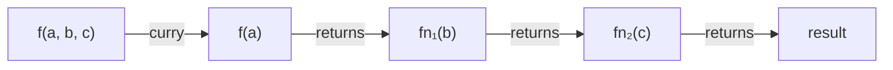

- **Example:**
  ```js
  const curry = f => a => b => c => f(a, b, c);
  ```
- **Learn more:** [Mostly Adequate Guide Ch. 4](https://mostly-adequate.gitbook.io/mostly-adequate-guide/ch04)

### Partial Application
- Pre-fill some arguments: `fn.bind(null, a)` or `(b, c) => f(a, b, c)`.

### Composition
- `compose(f, g)(x) === f(g(x))`. Pipe is the same thing left-to-right.

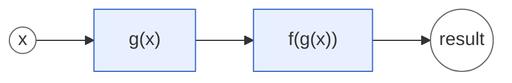

### Point-Free Style
- Define functions without naming arguments. Reads cleanly when not abused.
  ```js
  // pointful
  const trimAll = arr => arr.map(x => x.trim());
  // point-free
  const trimAll = arr => arr.map(s => s.trim()); // already short — overrated for plain JS
  ```

### IIFE (Immediately Invoked Function Expression)
- `(function(){...})()` — pre-ESM module scope. Mostly historical now, but still used in bundled IIFE outputs.
- **Learn more:** [MDN: IIFE](https://developer.mozilla.org/en-US/docs/Glossary/IIFE)

### Arrow Function Semantics
- No own `this`, `arguments`, `super`, or `new.target`. Not constructable. Lexical `this` makes them ideal for callbacks but wrong for methods that need their own `this`.
- **Learn more:** [MDN: Arrow functions](https://developer.mozilla.org/en-US/docs/Web/JavaScript/Reference/Functions/Arrow_functions)

---

## 5. Async Patterns

### Callback Hell / Pyramid of Doom
- Nested callbacks growing rightward, error handling repeated at every level. The historical motivation for Promises.

### Promise States
- **pending → fulfilled / rejected**. Settled once; immutable.

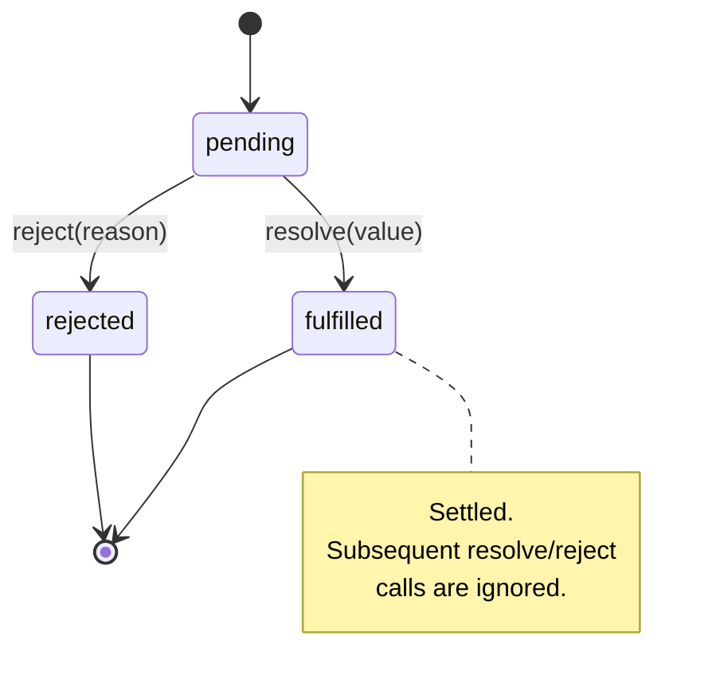

- **Learn more:** [MDN: Promise](https://developer.mozilla.org/en-US/docs/Web/JavaScript/Reference/Global_Objects/Promise)

### Promise Chaining
- `.then` always returns a new Promise. Return a value or another Promise to keep the chain flat.
- **Pitfall:** Forgetting to `return` inside `.then` — breaks chaining and error propagation.

### async / await
- Sugar over Promises. `await` suspends only the enclosing async function; the event loop keeps spinning.

```mermaid
sequenceDiagram
    participant Caller as Caller
    participant Async as async fn()
    participant Loop as Event Loop
    participant API as Web API / I/O

    Caller->>Async: invoke
    Async->>API: fetch(url)
    Async-->>Caller: returns Promise (pending)
    Note over Async: function suspended at await
    Loop->>Loop: keeps running other tasks
    API-->>Loop: response ready (microtask)
    Loop->>Async: resume after await
    Async-->>Caller: Promise fulfilled
```

- **Pitfall:** Sequential `await` in a loop when parallel would do.
  ```js
  // sequential — slow
  for (const u of urls) results.push(await fetch(u));
  // parallel — fast
  const results = await Promise.all(urls.map(u => fetch(u)));
  ```

### Promise Combinators
- `Promise.all` — fail-fast.
- `Promise.allSettled` — wait for all, regardless of outcome.
- `Promise.race` — first to settle.
- `Promise.any` — first to fulfill (ignores rejections until all reject).

| Combinator | Resolves when | Rejects when |
|---|---|---|
| `Promise.all` | **all** fulfill | **any** rejects (fail-fast) |
| `Promise.allSettled` | all settle (never rejects) | — |
| `Promise.race` | **first** settles (either way) | first rejection wins |
| `Promise.any` | **first** fulfills | **all** reject (AggregateError) |

- **Learn more:** [MDN: Promise — static methods](https://developer.mozilla.org/en-US/docs/Web/JavaScript/Reference/Global_Objects/Promise#static_methods)

### Unhandled Rejection
- A rejected Promise nobody catches. Node emits `unhandledRejection`; browsers fire the event on `window`. Modern Node crashes by default.

### AbortController
- Cancellation token for `fetch`, timers, and any API that accepts a `signal`.
  ```js
  const ctrl = new AbortController();
  fetch(url, { signal: ctrl.signal });
  setTimeout(() => ctrl.abort(), 5000);
  ```
- **Learn more:** [MDN: AbortController](https://developer.mozilla.org/en-US/docs/Web/API/AbortController)

### Async Iterator / for await…of
- Streaming async sequences. Reading from a file or paginated API line by line.
  ```js
  for await (const chunk of stream) process(chunk);
  ```
- **Learn more:** [MDN: for await...of](https://developer.mozilla.org/en-US/docs/Web/JavaScript/Reference/Statements/for-await...of)

### Backpressure
- Producer outpacing consumer. Node streams handle it via `pause()`/`resume()` and `highWaterMark`.

---

## 6. Modern Syntax (ES2015+)

### Destructuring
```js
const { name, age: years = 0 } = user;
const [first, ...rest] = list;
```
[MDN: Destructuring](https://developer.mozilla.org/en-US/docs/Web/JavaScript/Reference/Operators/Destructuring_assignment)

### Spread / Rest
- `...` spreads in arrays/objects/calls; gathers in parameters/patterns.

### Default Parameters
- Only used when argument is `undefined` — *not* when `null`.

### Template Literals & Tagged Templates
```js
const html = sanitize`<p>${userInput}</p>`;
```

### Optional Chaining (`?.`)
- Short-circuits to `undefined` on `null`/`undefined`.
  ```js
  user?.address?.zip
  fn?.(args)
  arr?.[i]
  ```

### Nullish Coalescing (`??`)
- Falls back **only** on `null`/`undefined` (unlike `||` which falls back on any falsy).
  ```js
  const port = config.port ?? 3000;  // keeps 0 if user set it
  const port = config.port || 3000;  // overrides 0 — bug
  ```

### Logical Assignment
- `a ??= b`, `a ||= b`, `a &&= b` — assign only if left side meets condition.

### Generators (`function*` / `yield`)
- Pausable functions. Underpin redux-saga, coroutines, custom iterators.
  ```js
  function* fibs() {
    let [a, b] = [0, 1];
    while (true) { yield a; [a, b] = [b, a + b]; }
  }
  ```
- **Learn more:** [MDN: Generators](https://developer.mozilla.org/en-US/docs/Web/JavaScript/Reference/Statements/function*)

### Top-Level Await
- Only inside ES modules. Blocks the module's evaluation until resolved.

---

## 7. Modules

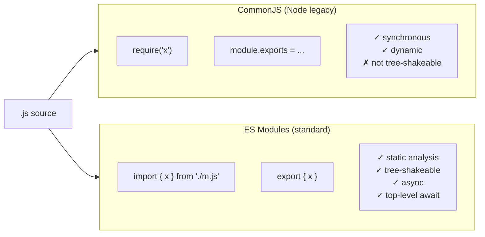

### CommonJS (CJS)
- Node's original system: `require` / `module.exports`. Synchronous, dynamic, runtime resolution.
- **Learn more:** [Node: CommonJS](https://nodejs.org/api/modules.html)

### ES Modules (ESM)
- The standard: `import` / `export`. Static, async, tree-shakeable. File extension or `"type": "module"` in `package.json` triggers ESM in Node.
- **Learn more:** [Node: ECMAScript modules](https://nodejs.org/api/esm.html) · [MDN: Modules](https://developer.mozilla.org/en-US/docs/Web/JavaScript/Guide/Modules)

### Dynamic Import
- `import('./mod.js')` returns a Promise. Basis of code splitting in bundlers.

### Tree Shaking
- Dead-code elimination via static ESM analysis. Requires `sideEffects: false` in `package.json` (or proper marking) and ESM exports.
- **Learn more:** [webpack: Tree Shaking](https://webpack.js.org/guides/tree-shaking/)

### Dual Package Hazard
- A package shipped as both CJS and ESM can be loaded twice → two copies, two class identities. Avoid with conditional `exports` field done correctly.

---

## 8. Design Patterns in JS

### Module Pattern / Revealing Module
- Pre-ESM encapsulation via IIFE + closure. Now mostly historical.

### Observer / EventEmitter
- Subjects notify listeners. Node's `events.EventEmitter`, DOM events.

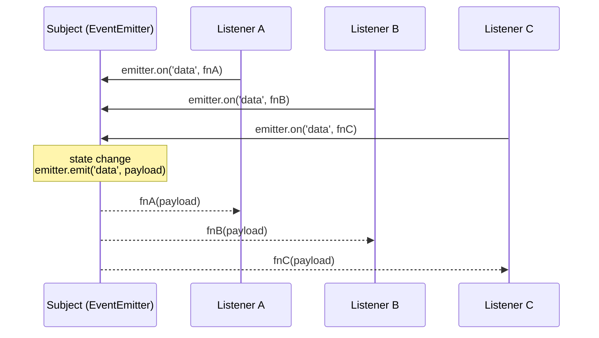

- **Learn more:** [Node: events](https://nodejs.org/api/events.html)

### Pub/Sub
- Like Observer but with a broker — subscribers don't know publishers.

### Singleton
- One shared instance. In ESM, modules are already singletons — `export default new Service()`.

### Factory Function
- Returns an object without `new`. Avoids `this` headaches.
  ```js
  const makeUser = (name) => ({ name, greet() { return `hi ${name}`; } });
  ```

### Mixin / Composition
- Combine behaviors via `Object.assign(target, ...sources)`. Composition over inheritance.

### Middleware Pattern
- `(ctx, next) => { ... }` — Express, Koa, Redux. Each middleware decides whether to call `next`.

```mermaid
flowchart LR
    Req([Request]) --> M1["Logger<br/>middleware"]
    M1 -->|next()| M2["Auth<br/>middleware"]
    M2 -->|next()| M3["Body parser"]
    M3 -->|next()| Handler[Route handler]
    Handler -->|response bubbles up| M3
    M3 --> M2
    M2 --> M1
    M1 --> Res([Response])
```

### Strategy Pattern
- Swap algorithms by passing functions. Very natural in JS because functions are values.

**Reference book:** [Learning JavaScript Design Patterns — Addy Osmani](https://www.patterns.dev/) (free online)

---

## 9. Error Handling

### try/catch/finally
- Synchronous capture. Works in async functions for `await`-ed Promises.

### Error Cause
- `new Error('failed', { cause: original })` — preserves chain.
- **Learn more:** [MDN: Error.cause](https://developer.mozilla.org/en-US/docs/Web/JavaScript/Reference/Global_Objects/Error/cause)

### Custom Error Classes
```js
class ValidationError extends Error {
  constructor(field, msg) {
    super(`${field}: ${msg}`);
    this.name = 'ValidationError';
    this.field = field;
  }
}
```

### Fail Fast
- Validate at boundaries, throw immediately. Don't carry invalid state through the system.

### Result / Either Types
- Functional alternative to throwing. Libraries: [neverthrow](https://github.com/supermacro/neverthrow), [Effect](https://effect.website/).

---

## 10. Performance & Memory

### V8 / JIT
- The engine that powers Chrome, Node, Edge, Deno. Inlines monomorphic call sites; deoptimizes when shapes change.
- **Learn more:** [v8.dev/blog](https://v8.dev/blog) · [Mathias Bynens: *V8 internals for JavaScript developers*](https://www.youtube.com/watch?v=p-iiEDtpy6I)

### Garbage Collection
- Mark-and-sweep with generational hypothesis. References keep objects alive.

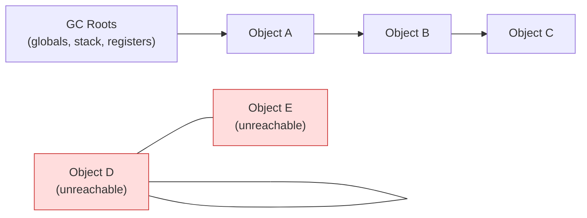

> Reachable from roots → kept. Mutual references but unreachable from roots → swept.

- **Learn more:** [v8.dev: Trash talk](https://v8.dev/blog/trash-talk)

### Memory Leaks
- Common sources:
  1. Forgotten `setInterval` / event listeners.
  2. Closures capturing large objects.
  3. Detached DOM nodes still referenced from JS.
  4. Global caches without eviction.
- **Tool:** Chrome DevTools → Memory tab → heap snapshot.
- **Learn more:** [web.dev: Memory issues](https://web.dev/articles/memory-leaks)

### Debounce vs Throttle

```
Raw events:     ▌▌▌▌    ▌▌▌▌▌▌▌▌▌▌    ▌▌▌▌    ▌▌▌▌▌▌▌▌▌▌▌▌▌

Debounce(200): ───────────●─────────────────●─────────────────────●
               (fires once, AFTER quiet period of 200ms)

Throttle(200): ▌──▌──▌──▌──▌──▌──▌──▌──▌──▌──▌──▌──▌──▌──▌──▌──▌─
               (fires at most once every 200ms while events stream)
```

- **Debounce:** wait until events stop for N ms, then fire once. (Search inputs.)
- **Throttle:** fire at most once per N ms. (Scroll, resize, mousemove.)

### Memoization
- Cache return values by argument identity. Watch memory growth — use LRU when unbounded.

### Web Workers
- Off-main-thread compute. Communicate via `postMessage` (structured clone).
- **Learn more:** [MDN: Web Workers](https://developer.mozilla.org/en-US/docs/Web/API/Web_Workers_API)

### Lazy Loading / Code Splitting
- Defer work until needed. Dynamic `import()` is the modern primitive.

### Virtual DOM / Reconciliation
- React's diff-and-patch model. Vue uses one too. Modern frameworks (Svelte, Solid) skip it via compile-time reactivity.

---

## 11. Testing

### AAA (Arrange / Act / Assert)
- Standard 3-section test layout.

### Given / When / Then
- BDD phrasing equivalent. Common in Cucumber, Jasmine.

### TDD Red → Green → Refactor

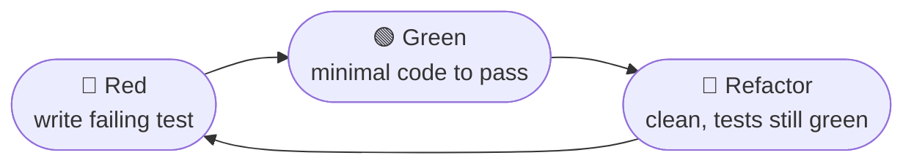

- Write failing test → make it pass minimally → improve code with tests as safety net.
- **Reference:** [Kent Beck — *Test-Driven Development by Example*](https://www.oreilly.com/library/view/test-driven-development/0321146530/)

### Test Double Taxonomy (Meszaros)

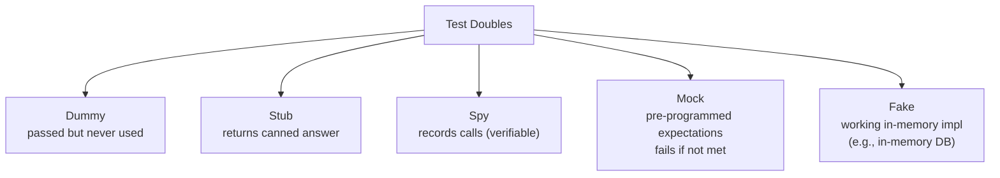

- **Learn more:** [Martin Fowler: Mocks Aren't Stubs](https://martinfowler.com/articles/mocksArentStubs.html)

### Snapshot Testing
- Serialize output, compare against committed snapshot. Use sparingly — easy to rubber-stamp updates.

### Property-Based Testing
- Generate inputs, assert invariants. Library: [fast-check](https://fast-check.dev/).

### Runners
- **Vitest** — modern, ESM-first, Vite-powered. Default for new projects.
- **Jest** — Facebook's runner. Still everywhere.
- **Playwright / Cypress** — E2E in real browsers.
- **Learn more:** [Vitest](https://vitest.dev/) · [Testing Library](https://testing-library.com/)

---

## 12. Tooling

### Bundler
- Builds the dependency graph and produces deployable output.

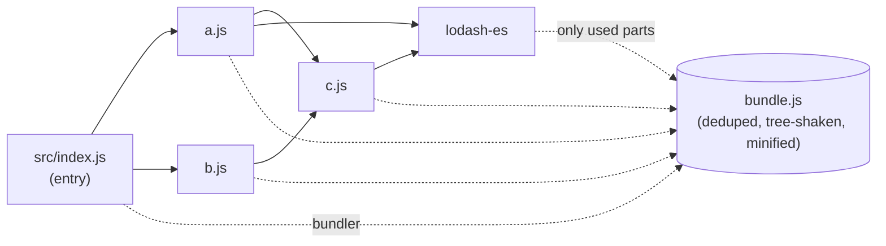

- **esbuild** (Go, fastest), **Vite** (esbuild + Rollup), **webpack** (most flexible, slowest), **Rollup** (library-focused), **Turbopack** (Next.js, Rust), **Bun**.

### Transpiler
- Rewrites newer syntax to a chosen target. **Babel** (JS), **SWC** (Rust), **TypeScript** (also type-checks), **esbuild**.

### Polyfill vs Transpile
- **Transpile:** syntax (`?.`, classes, arrow funcs).
- **Polyfill:** runtime APIs (`Array.prototype.flat`, `Promise`, `fetch`).
- Use [core-js](https://github.com/zloirock/core-js) for polyfills.

### Source Map
- Maps minified/transpiled lines back to source for debugging. Ship `.map` files separately or as inline base64.

### Monorepo / Workspaces
- pnpm workspaces, npm workspaces, Yarn workspaces. Add an orchestrator: **Turborepo** or **Nx**.
- **Learn more:** [pnpm workspaces](https://pnpm.io/workspaces) · [Turborepo](https://turbo.build/repo)

### Lockfile
- `package-lock.json`, `pnpm-lock.yaml`, `yarn.lock`. Pins the entire resolved tree for reproducibility. Commit it.

### Semver
- `MAJOR.MINOR.PATCH`. `^1.2.3` ≈ `>=1.2.3 <2.0.0`. `~1.2.3` ≈ `>=1.2.3 <1.3.0`.
- **Learn more:** [semver.org](https://semver.org/)

### Linters & Formatters
- **ESLint** for correctness, **Prettier** for formatting, **Biome** as a unified Rust-based alternative.
- **Learn more:** [eslint.org](https://eslint.org/) · [prettier.io](https://prettier.io/) · [biomejs.dev](https://biomejs.dev/)

---

## 13. Browser Runtime

### DOM / BOM
- DOM = document structure. BOM = `window`, `location`, `history`, `navigator`.

### Shadow DOM & Web Components
- Encapsulated DOM trees with scoped styles. Foundation of `<custom-element>`s.
- **Learn more:** [MDN: Web Components](https://developer.mozilla.org/en-US/docs/Web/API/Web_components)

### Critical Rendering Path

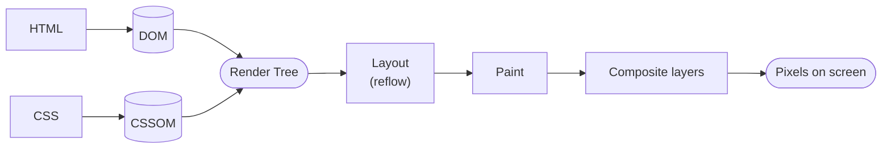

- **Learn more:** [web.dev: Critical rendering path](https://web.dev/articles/critical-rendering-path)

### Reflow vs Repaint
- **Reflow (layout):** geometry changed. Expensive.
- **Repaint:** pixels changed, layout unchanged.
- Batching reads/writes avoids "layout thrashing".

### CORS / Same-Origin Policy
- Cross-origin requests need server consent via headers (`Access-Control-Allow-Origin`).
- **Learn more:** [MDN: CORS](https://developer.mozilla.org/en-US/docs/Web/HTTP/CORS)

### CSP (Content Security Policy)
- HTTP header that whitelists script/style sources. Primary defense against XSS.
- **Learn more:** [MDN: CSP](https://developer.mozilla.org/en-US/docs/Web/HTTP/CSP)

### Storage
- **localStorage / sessionStorage** — sync, ~5 MB, string-only.
- **IndexedDB** — async, large, structured.
- **Cache API** — request/response store for Service Workers.
- **Cookies** — sent with every request unless `SameSite=None` is restricted.

### Service Worker / PWA
- Programmable proxy between page and network. Enables offline, push, background sync.
- **Learn more:** [web.dev: Service workers](https://web.dev/learn/pwa/service-workers/)

---

## 14. Node.js Runtime

### Node Event Loop Phases

```mermaid
flowchart LR
    T["⏱ Timers<br/>(setTimeout / setInterval)"] --> P["Pending callbacks"]
    P --> I["Idle / prepare<br/>(internal)"]
    I --> Poll["📥 Poll<br/>(I/O callbacks)"]
    Poll --> C["✅ Check<br/>(setImmediate)"]
    C --> Cl["Close callbacks"]
    Cl --> T

    Micro["microtasks +<br/>process.nextTick"]
    Micro -. between every phase .-> T
    Micro -. .-> Poll
    Micro -. .-> C
```

- **Learn more:** [Node: The Event Loop](https://nodejs.org/en/learn/asynchronous-work/event-loop-timers-and-nexttick)

### Streams
- `Readable`, `Writable`, `Duplex`, `Transform`. Backpressure built in. Always handle `'error'`.
- **Learn more:** [Node: Stream](https://nodejs.org/api/stream.html)

### Buffer
- Raw binary. `Buffer.from`, `buf.toString('utf8')`. Pre-`Uint8Array`; modern code often uses both interchangeably.

### Worker Threads
- True parallelism via `worker_threads`. Shared memory via `SharedArrayBuffer`/`Atomics`.

### Cluster
- Fork N worker processes sharing a port. Mostly superseded by process managers (PM2) or container orchestrators.

### process.nextTick vs setImmediate
- `nextTick` fires before any I/O — can starve the loop if abused.
- `setImmediate` fires after current poll phase.

### CommonJS Resolution
- `node_modules` lookup walks up the directory tree until found.
- **Learn more:** [Node: Modules: CommonJS modules](https://nodejs.org/api/modules.html#all-together)

---

## 15. TypeScript Bridge

### Structural Typing
- Compatibility by *shape*, not by name. `{x:1}` matches any `{x: number}` parameter.

### Discriminated Union
- A union of object types with a literal `kind` field. Enables exhaustive narrowing.
  ```ts
  type Shape =
    | { kind: 'circle'; r: number }
    | { kind: 'square'; s: number };
  ```

### Type Narrowing

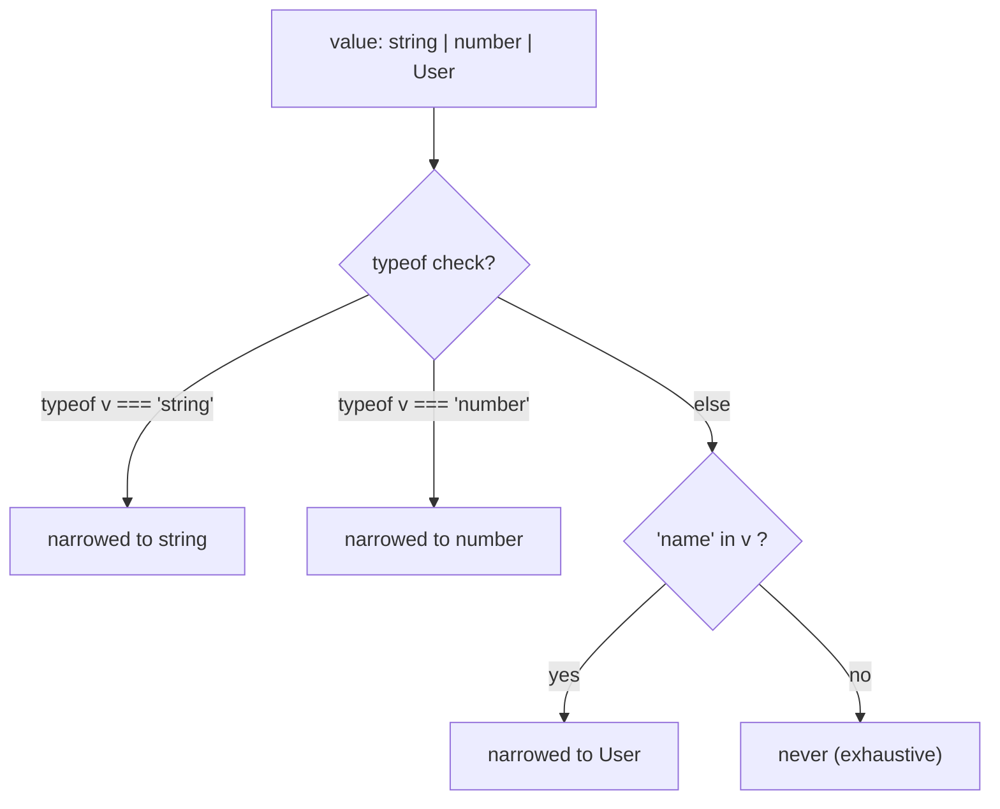

- TypeScript narrows by `typeof`, `instanceof`, `in`, equality checks, user-defined guards (`x is T`).

### Generics & Constraints
- `function pluck<T, K extends keyof T>(obj: T, key: K): T[K]`

### Utility Types
- `Partial<T>`, `Required<T>`, `Pick<T, K>`, `Omit<T, K>`, `Record<K, V>`, `ReturnType<F>`, `Awaited<P>`, `NonNullable<T>`.
- **Learn more:** [TS handbook: Utility Types](https://www.typescriptlang.org/docs/handbook/utility-types.html)

### `unknown` vs `any`
- `unknown` is the safe top type — you must narrow before use. `any` disables the type system. Prefer `unknown`.

**Main reference:** [TypeScript Handbook](https://www.typescriptlang.org/docs/handbook/intro.html)

---

## 16. Using anchors with LLMs

The whole point: instead of describing what you want, **name the anchor**.

```
❌ "Make this work when nested fields might be missing"
✅ "Refactor using optional chaining and nullish coalescing"

❌ "Speed up this function — it recalculates the same thing"
✅ "Add memoization keyed on the first argument with an LRU bound"

❌ "Why does my console.log show the wrong order?"
✅ "Walk me through the event loop, microtask queue, and when each await suspends in this function"

❌ "Make sure two requests don't run at the same time"
✅ "Add an AbortController and cancel the previous in-flight request when a new one starts"

❌ "I want to share logic between these classes without copy-paste"
✅ "Refactor to composition with a mixin, or a strategy-pattern function parameter"

❌ "Tests broke when I updated the lib"
✅ "Was the change a breaking semver-major bump? Pin or update; check for dual-package hazard if it's a hybrid CJS/ESM package"
```

The mental model: **the LLM already knows what each anchor means in canonical form.** Your job is to pick the right one, and to notice when your situation deviates from the canonical case (that's the part you need to spell out).

---

## 17. Curated learning paths & books

### Foundational (free)
- **MDN Web Docs** — [developer.mozilla.org](https://developer.mozilla.org/en-US/docs/Web/JavaScript) — the canonical reference.
- **Eloquent JavaScript** — [eloquentjavascript.net](https://eloquentjavascript.net/) — a real book, read online for free.
- **The Modern JavaScript Tutorial** — [javascript.info](https://javascript.info/) — best long-form tutorial; covers everything in this guide and more.
- **You Don't Know JS Yet** (2nd ed) — [github.com/getify/You-Dont-Know-JS](https://github.com/getify/You-Dont-Know-JS) — Kyle Simpson's deep dive.

### Advanced & engine internals
- **v8.dev/blog** — V8 engine releases & explanations.
- **web.dev** — performance & browser APIs from the Chrome team.
- **TC39 proposals** — [github.com/tc39/proposals](https://github.com/tc39/proposals) — see what's coming.
- **ECMA-262 spec** — [tc39.es/ecma262](https://tc39.es/ecma262/) — the actual standard.

### Patterns & architecture
- **Learning JavaScript Design Patterns** — Addy Osmani, free at [patterns.dev](https://www.patterns.dev/).
- **Refactoring** — Martin Fowler — language-agnostic, examples in JS in 2nd edition.
- **Mostly Adequate Guide to FP** — [github.com/MostlyAdequate/mostly-adequate-guide](https://github.com/MostlyAdequate/mostly-adequate-guide).

### Async deep dive
- **Jake Archibald** — *In The Loop* talk + [task/microtask article](https://jakearchibald.com/2015/tasks-microtasks-queues-and-schedules/).
- **Lydia Hallie** — [JavaScript Visualized series](https://www.lydiahallie.com/blog) — event loop, hoisting, prototype chain, generators with animated diagrams.

### Node.js
- **Node official docs** — [nodejs.org/api](https://nodejs.org/api/) — surprisingly readable.
- **Node.js Design Patterns** — Mario Casciaro, Luciano Mammino — best book for Node-specific patterns.

### TypeScript
- **TypeScript Handbook** — [typescriptlang.org/docs/handbook](https://www.typescriptlang.org/docs/handbook/intro.html).
- **Type-Level TypeScript** — [type-level-typescript.com](https://type-level-typescript.com/) — for advanced types.
- **Matt Pocock's tutorials** — [totaltypescript.com](https://www.totaltypescript.com/).

### Testing
- **Testing Library docs** — [testing-library.com](https://testing-library.com/).
- **Kent C. Dodds' testing articles** — [kentcdodds.com/blog?q=test](https://kentcdodds.com/blog?q=test).

### Newsletters / staying current
- **JavaScript Weekly** — [javascriptweekly.com](https://javascriptweekly.com/).
- **Node Weekly** — [nodeweekly.com](https://nodeweekly.com/).
- **Bytes** — [bytes.dev](https://bytes.dev/).

### Hands-on practice
- **Exercism — JS track** — [exercism.org/tracks/javascript](https://exercism.org/tracks/javascript) — with mentor reviews.
- **JavaScript30** — [javascript30.com](https://javascript30.com/) — 30 small browser projects, no frameworks.
- **Frontend Mentor** — [frontendmentor.io](https://www.frontendmentor.io/) — realistic UI challenges.

---

## A recommended order

If you're starting fresh or filling gaps:

1. **Syntax & types** (sections 2, 6) — javascript.info chapters 1–5.
2. **Execution model** (section 1) — javascript.info chapter on closures + Lydia Hallie's event loop article.
3. **Objects & prototypes** (section 3) — YDKJS *Objects & Classes*.
4. **Functions & FP** (section 4) — Mostly Adequate Guide chapters 1–6.
5. **Async** (section 5) — javascript.info Promises chapter + Jake Archibald talk.
6. **Modules & tooling** (sections 7, 12) — read your project's `vite.config` / `tsconfig` line by line; you'll learn faster than from any tutorial.
7. **Design patterns** (section 8) — patterns.dev.
8. **Runtime specifics** (sections 13 or 14) — pick the one matching your work.
9. **TypeScript** (section 15) — only after you're comfortable with JS itself.

Don't try to read everything. Pick one anchor per day, write 10 lines that demonstrate it, and move on. In ~6 weeks you'll have walked the entire vocabulary.
