# React `useRef` Hook and Comparison with Vue.js

This document provides a comprehensive guide to React's `useRef` Hook, explaining its dual purpose, internal workings, common use cases, and how it compares to Vue.js's reactivity and DOM reference system (`ref`).

---

## 1. What is `useRef` in React?

In React, `useRef` is a built-in Hook that returns a **mutable ref object** whose `.current` property is initialized with the passed argument (`initialValue`). 

The defining characteristic of `useRef` is:
> **Updating the ref's `.current` property does NOT trigger a component re-render.**

### The Structure of a Ref
Under the hood, React implements `useRef` as a plain JavaScript object. On the initial render, `useRef(initialValue)` returns:
```javascript
{
  current: initialValue
}
```
During subsequent renders, React returns the **exact same object instance** (reference-stable). You can mutate its `.current` property directly:
```javascript
const myRef = useRef(10);
myRef.current = 20; // Mutates the value, but does not trigger a re-render!
```

---

## 2. The Dual Nature of `useRef`

`useRef` is a multi-tool in React, serving two primary, distinct purposes:

### A. A Persistent, Mutable "Box" (Like Instance Variables)
Because React component functions re-run in their entirety on every single render, any normal local variable declared inside the function is re-created and reset:
```javascript
function Counter() {
  let count = 0; // ❌ Reset to 0 on every single render!
  // ...
}
```
If you want to keep track of a value across renders *without* causing a re-render when it changes (which `useState` would do), you use a ref:
```javascript
function Counter() {
  const countRef = useRef(0); // ✅ Persists between renders; changing it won't trigger re-renders.
  
  const handleIncrement = () => {
    countRef.current += 1;
    console.log(countRef.current); // Logs the updated value immediately
  };
}
```

### B. Direct DOM Access (Template Refs)
React's declarative approach means you rarely touch the real DOM. However, sometimes you need direct access to DOM nodes to:
* Manage focus, text selection, or media playback.
* Trigger animations.
* Measure DOM node dimensions or scroll positions.

To do this, pass the ref object to the `ref` attribute of a JSX element:
```javascript
function Form() {
  const inputRef = useRef(null);

  const focusInput = () => {
    inputRef.current.focus(); // ✅ inputRef.current points directly to the <input> DOM element
  };

  return (
    <>
      <input ref={inputRef} type="text" />
      <button onClick={focusInput}>Focus Input</button>
    </>
  );
}
```

---

## 3. How React Updates Refs Under the Hood

During the React render cycle, state changes and ref mutations are handled completely differently:

```mermaid
flowchart TD
    subgraph State Update ["State Update Flow"]
        A[setCount] --> B["Queue State Update in Fiber"]
        B --> C["Trigger Component Re-render"]
        C --> D["Function Re-runs with New State Snapshot"]
        D --> E["Update DOM if needed"]
    end

    subgraph Ref Update ["Ref Update Flow"]
        F["ref.current = newValue"] --> G["Mutate JavaScript Object Property in-place"]
        G --> H["Immediate value update (No Re-render)"]
        H --> I["Component Function NOT executed"]
    end

    style B fill:#ffe5ec,stroke:#ff85a1,stroke-width:1px
    style C fill:#ffe5ec,stroke:#ff85a1,stroke-width:1px
    style G fill:#e8f0fe,stroke:#4285f4,stroke-width:1px
    style H fill:#e8f0fe,stroke:#4285f4,stroke-width:1px
```



### Why React Doesn't Re-render on Ref Mutation
React triggers a re-render when a state setter (e.g., `setCount`) is called because it flags the Fiber node as "dirty" and schedules a render microtask. 
Mutating `ref.current = newValue` is a simple mutation of a regular JavaScript object property. React does not intercept property assignments on the ref object, so it has no way of knowing (and does not care) that the value changed.

---

## 4. Comparison: React `useRef` vs Vue.js `ref`

There is a fundamental difference in how React and Vue design their API. 
* In React, `useRef` is **explicitly non-reactive**.
* In Vue, `ref()` is the **primary way to define reactive state**.

Here is a side-by-side comparison:

| Feature | React `useRef` | Vue.js `ref()` |
| :--- | :--- | :--- |
| **Primary Purpose** | Persisting mutable data without re-rendering OR accessing DOM elements. | Defining reactive state (primitives) OR accessing DOM elements. |
| **Does it cause re-renders?** | ❌ **No**. Changing `.current` never triggers a re-render. |  **Yes**. Mutating `.value` triggers reactivity and updates the DOM. |
| **How to access value** | `.current` (e.g., `myRef.current`) | `.value` in JS (e.g., `myRef.value`), automatically unwrapped in templates. |
| **Under the hood mechanism** | Plain JavaScript object `{ current: initialValue }` with stable reference. | Reactive wrapper using ES6 getters/setters (Vue 3 `RefImpl`) or `Proxy`. |
| **DOM Association** | `<div ref={myRef}>` | `<div ref="myRef">` (Matching variable name in script) |
| **Surviving Re-runs** | Required because the entire component function re-runs on every render. | Not strictly needed for non-reactive variables because `<script setup>` runs only once. |

### The "Execution Lifecycle" Difference
One of the most critical conceptual differences between React and Vue is their component lifecycle:

* **React (Pull model)**: The component function executes **every time** the UI needs an update. Because of this, variables are re-created on every render. To persist any value between renders, you must box it inside a Hook like `useRef` or `useState`.
* **Vue (Push model/Reactivity)**: The `<script setup>` or `setup()` function executes **exactly once** when the component is created. Vue compiles the template into a render function that tracks reactive dependencies (`ref()`, `computed()`). When reactive dependencies change, Vue surgically executes the render function, **but does not re-run the setup script**.

#### Visualizing the Lifecycle Differences:

```text
REACT (Re-runs Entire Function on Render):
[Render 1] ──> Run Component Function ──> Create let x = 0 (reset)
[Render 2] ──> Run Component Function ──> Create let x = 0 (reset)
(useRef is needed to bypass this resetting)

VUE (Runs Setup Script Once):
[Mount] ──> Run Setup Script ──> Create let x = 0 (never re-run!)
[Re-render] ──> Run Render Function (Internal) ──> (x remains persisted in closure scope)
```

Therefore, in Vue, if you want a mutable helper variable that persists across renders and does **not** trigger re-renders, you can use a **plain JavaScript variable** inside your `<script setup>`!

```vue
<!-- Vue.js: Non-reactive persistent value -->
<script setup>
let timerId = null; // ✅ Persists for the lifetime of this component instance! No hook required.

const startTimer = () => {
  timerId = setInterval(() => {
    console.log("Tick");
  }, 1000);
};

const stopTimer = () => {
  clearInterval(timerId);
};
</script>
```

---

## 5. Side-by-Side Code Examples

### Example 1: Direct DOM Reference (Focusing an Input)

#### React Implementation
```jsx
import { useRef } from 'react';

export default function FocusInput() {
  // 1. Declare the ref object
  const inputRef = useRef(null);

  const handleClick = () => {
    // 3. Access the DOM node via .current
    inputRef.current.focus();
  };

  return (
    <div>
      {/* 2. Bind the ref to the element */}
      <input ref={inputRef} type="text" placeholder="Click button to focus me..." />
      <button onClick={handleClick}>Focus Input</button>
    </div>
  );
}
```

#### Vue.js Implementation (Vue 3 Composition API)
```vue
<script setup>
import { ref, onMounted } from 'vue';

// 1. Declare a ref initialized with null.
// The name of the variable MUST match the ref attribute in the template!
const inputRef = ref(null);

const handleClick = () => {
  // 3. Access the DOM node via .value
  inputRef.value.focus();
};
</script>

<template>
  <div>
    <!-- 2. Bind the ref using the matching name string -->
    <input ref="inputRef" type="text" placeholder="Click button to focus me..." />
    <button @click="handleClick">Focus Input</button>
  </div>
</template>
```

---

### Example 2: Mutable State without Re-renders (Stopwatch/Timer)

#### React Implementation
```jsx
import { useState, useRef } from 'react';

export default function Timer() {
  const [seconds, setSeconds] = useState(0);
  // Keep track of the interval ID.
  // Using useState for intervalId would cause unnecessary re-renders.
  // Using let intervalId would reset to null on every render.
  const timerRef = useRef(null);

  const startTimer = () => {
    if (timerRef.current !== null) return;
    
    timerRef.current = setInterval(() => {
      setSeconds((prev) => prev + 1);
    }, 1000);
  };

  const stopTimer = () => {
    clearInterval(timerRef.current);
    timerRef.current = null;
  };

  return (
    <div>
      <h1>Time: {seconds}s</h1>
      <button onClick={startTimer}>Start</button>
      <button onClick={stopTimer}>Stop</button>
    </div>
  );
}
```

#### Vue.js Implementation (Vue 3 Composition API)
```vue
<script setup>
import { ref } from 'vue';

const seconds = ref(0);
// Because setup() runs only once, we can use a plain JavaScript variable
// to hold the non-reactive interval ID.
let timerId = null;

const startTimer = () => {
  if (timerId !== null) return;

  timerId = setInterval(() => {
    seconds.value++;
  }, 1000);
};

const stopTimer = () => {
  clearInterval(timerId);
  timerId = null;
};
</script>

<template>
  <div>
    <h1>Time: {{ seconds }}s</h1>
    <button @click="startTimer">Start</button>
    <button @click="stopTimer">Stop</button>
  </div>
</template>
```

---

## 6. Summary Cheat Sheet

1. **React's `useRef`** serves two purposes: keeping mutable data across renders without triggering a re-render, and grabbing physical DOM elements.
2. **React components re-run fully** on every render, making `useRef` essential to preserve local, non-reactive variables.
3. **Vue's `ref()`** is reactive. Changing `ref.value` **triggers visual changes**.
4. **Vue's template refs** use the same `ref()` syntax but bind to DOM elements after mounting by matching the variable name to the template `ref="..."` string.
5. **Vue's setup executes once**, allowing you to use plain JS variables (`let`) for non-reactive persistent data, whereas React requires `useRef`.
